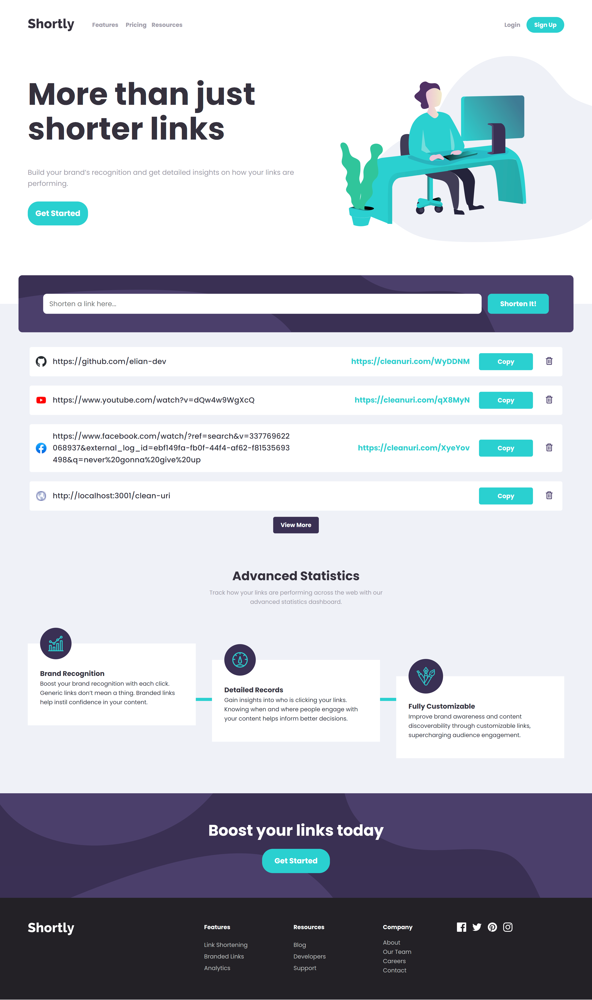

# Frontend Mentor - Shortly URL shortening API Challenge solution

This is a solution to the [Shortly URL shortening API Challenge challenge on Frontend Mentor](https://www.frontendmentor.io/challenges/url-shortening-api-landing-page-2ce3ob-G). Frontend Mentor challenges help you improve your coding skills by building realistic projects.

## Table of contents

- [Overview](#overview)
  - [The challenge](#the-challenge)
  - [Screenshot](#screenshot)
  - [Links](#links)
- [My process](#my-process)
  - [Built with](#built-with)
  - [What I learned](#what-i-learned)
  - [Useful resources](#useful-resources)
- [Author](#author)

## Overview

### The challenge

Users should be able to:

- View the optimal layout for the site depending on their device's screen size
- Shorten any valid URL
- See a list of their shortened links, even after refreshing the browser
- Copy the shortened link to their clipboard in a single click
- Receive an error message when the `form` is submitted if:
  - The `input` field is empty

### Screenshot

### Links

- Solution URL: [Add solution URL here](https://github.com/elian-dev/short-url-api-landing)
- Live Site URL: [Add live site URL here](https://shortly-urls.vercel.app/)

## My process

### Built with

- Semantic HTML5 markup
- CSS custom properties
- Flexbox
- CSS Grid
- Mobile-first workflow
- [Vue JS](https://reactjs.org/) - Frontend library
- [Node.js / Express.js](https://nextjs.org/) - Backend library

### What I learned

I learned about Vue.js composition API with Typescript, fundamentals and  and how to use transitions in Vue.js

I learned about Server-Side Rendering (SSR) in Vue.js in order to do tests locally.

And also, I created a intermediate server using Node.js and Express to do requests to the cleanuri.com API in order to avoid some CORS issues.

[Repo of the server](https://github.com/elian-dev/intermediate-server-cleanuri)

### Useful resources

- [Clean Uri](https://cleanuri.com/docs) - CleanUri API oficial documentation

## Author

- Website - [elian-dev](https://github.com/elian-dev)
- Frontend Mentor - [@elian-dev](https://www.frontendmentor.io/profile/elian-dev)
- Linkedin - [@eliandev](https://www.linkedin.com/in/eliandev/)
